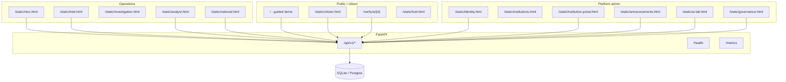

# MboaShield - End-to-end walkthrough (v2.8.0)

**Live:** https://mboashield.onrender.com
**Purpose:** See how every layer connects so you can prioritize improvements.

---

## 1. What runs in production right now

| Signal | Demo (Render) | Government (self-hosted) |
|---|---|---|
| Version | `2.8.0` via `/health` | Same image + env |
| Database | SQLite | Postgres (`DATABASE_URL`) |
| Auth | **Soft** (`AUTH_ENFORCE=false`) | Hard + MFA |
| Workers | Off (`workers: false`) | Celery + Redis/RabbitMQ |
| Metrics | On (`/metrics`) | Prometheus/Grafana in gov compose |

Confirm anytime:

```bash
curl -s https://mboashield.onrender.com/health | python3 -m json.tool
```

---

## 2. System map (one picture)



---

## 3. Guided tour (~25 minutes)

### A. Citizen story (guided demo) - 10 min

1. Open **https://mboashield.onrender.com/**
2. Click **Run guided demo** - walks 5 scenarios automatically.
3. Or manually:
   - **Text** -> `POST /api/v1/trust/assess` with `object_type=text`
   - **Identity** -> `POST /api/v1/trust/assess` with `object_type=impersonation`
   - **Audio** -> sample WAV -> `POST /api/v1/trust/assess/media`
   - **Image** -> sample JPG -> `POST /api/v1/trust/assess/media`
   - **Ambassadors** -> lessons -> `POST /api/v1/ambassadors/complete`
4. **AI Case** panel -> `POST /api/v1/analyze` - fused trust score; always `certainty: "none"`.

**What to notice:** Scores + plain-language explanations; no auto-public advisory.

### B. Report -> analyst -> national - 8 min

1. **https://mboashield.onrender.com/static/reports.html** - file / describe incident.
2. **https://mboashield.onrender.com/static/analyst.html** - queue, transition workflow states.
3. **https://mboashield.onrender.com/static/national.html** - aggregates from analytics APIs.

**Workflow states (backend truth):**
`open` -> `ai_analysis` -> `analyst_review` -> `institution_review` -> `decision` -> `public_advisory` -> `resolved` -> `archived`
(Also `dismissed`.)

### C. NTOC + intel + investigation - 5 min

1. **/static/ntoc.html** - threat level, cases linkage.
2. **/static/intel.html** - compliant sources (no scraping); ingest when configured.
3. **/static/investigation.html** - case workspace narrative.

### D. Trust infrastructure (Phases 9-14) - 7 min

| Step | URL | API |
|---|---|---|
| Evidence mindset | analyst / reports | `/api/v1/evidence/*` |
| Signed comms | `/static/announcements.html` | publish -> `/verify/a/{id}` |
| Public verify | `/static/verify-announcement.html` | `GET /verify/a/{id}` |
| AI registry & eval | `/static/ai-lab.html` | `/api/v1/ai-platform/*` |
| Governance | `/static/governance.html` | `/api/v1/governance/*` |
| Institution self-service | `/static/institution-portal.html` | `/api/v1/institution-portal/*` |
| Identity (MFA/OIDC) | `/static/identity.html` | `/api/v1/auth/*` |

### E. Docs for auditors - 2 min

- **Manuals index:** [`manuals/README.md`](manuals/README.md)
- **OpenAPI export:** `python scripts/export_openapi.py` -> `docs/manuals/openapi.json`
- **Interactive:** https://mboashield.onrender.com/docs

---

## 4. API layers (mental model)

| Layer | Prefix | Role |
|---|---|---|
| Checks (legacy demo) | `/api/v1/check/*` | Single-modality pitch checks |
| Intelligence | `/api/v1/intelligence/*` | 10 engines + fusion |
| Platform | users, institutions, audit | Foundation |
| Government | incidents, workflow | Ordered review states; hard auth required for actor accountability |
| NTOC / cases | operations | National ops |
| Intel | compliant ingest | Phase 8 |
| Evidence | vault + retention | Phase 9 |
| Announcements | signed comms | Phase 11 |
| AI platform | registry, eval | Phase 12 |
| Infra | metrics jobs | Phase 13 |
| Governance | consent, risks, cards | Phase 14 |

---

## 5. Data flow: one incident end-to-end

```text
Citizen check or report
    -> stored check / incident row (SQLite on Render)
    -> optional AI analysis state (workflow)
    -> analyst_review (intended human-review state)
    -> optional institution_review
    -> decision (intended human-decision state)
    -> optional public_advisory
    -> resolved -> archived
    -> feeds national analytics aggregates
    -> audit_log entries on privileged actions (when actors present)
```

Parallel paths:

- **High-risk check** can stay a check only (no incident).
- **Evidence upload** attaches hash + custody if analyst uses vault APIs.
- **Intel** can correlate external compliant feeds to cases (operator-driven).

---

## 6. Honesty rules (do not break in improvements)

1. `trust_score.certainty` defaults to **`"none"`**.
2. Model cards and governance dashboard state the same policy.
3. Optional `calibrated_score` is analyst support only.
4. State ordering requires `decision` before `public_advisory`; production policy must enforce a human actor through hard authentication and operating controls.

---

## 7. Known gaps -> improvement backlog

Use this list for your next sprint.

| Priority | Gap | Improvement idea |
|---|---|---|
| **P0** | Home footer missing AI lab / governance / hub | Link hub page from all consoles (done: `/static/hub.html`) |
| **P0** | Demo auth is soft; consoles do not enforce login | Wire JWT login on analyst/admin pages when `AUTH_ENFORCE=true` |
| **P1** | Journeys are fragmented across 17 HTML pages | Single "role-based" hub with checklist per persona |
| **P1** | Citizen consent UI only on governance page | Banner on citizen dashboard when optional features used |
| **P1** | Render uses SQLite | Attach Postgres for durable demo + run `alembic upgrade head` |
| **P2** | Workers off on Render | Keep off for cost; document "gov compose" for async jobs |
| **P2** | No automated E2E browser test | Playwright smoke: demo button + `/health` + governance health |
| **P2** | FR copy partial | Finish `app.js` i18n on gov consoles |
| **P3** | ONNX/transformers stub | Real model only when checksum + card approved |
| **P3** | WhatsApp channel | Cloud API behind feature flag + consent |

---

## 8. Quick local replay

```bash
cd mboashield
./scripts/run_demo.sh
# http://127.0.0.1:8000/static/hub.html
```

---

## 9. Related docs

- [`PRODUCT_STATUS.md`](PRODUCT_STATUS.md) - readiness baseline and backlog
- [`COMPLETE_USER_GUIDE.md`](COMPLETE_USER_GUIDE.md) - feature testing map
- [`ARCHITECTURE.md`](ARCHITECTURE.md) - technical layers
- [`ACCESS_AND_CONFIG.md`](ACCESS_AND_CONFIG.md) - roles and env
- [`manuals/USER.md`](manuals/USER.md) - citizen-facing
- [`manuals/OPERATIONS.md`](manuals/OPERATIONS.md) - on-call
