# MboaShield v1.0 — System Design

**Baseline:** v0.9.0 · **Program index:** [`V1_0_ENTERPRISE_INDEX.md`](V1_0_ENTERPRISE_INDEX.md)  
**Review:** [`V1_0_ARCHITECTURE_REVIEW.md`](V1_0_ARCHITECTURE_REVIEW.md)

This document is the target architecture for Phases 6–15. Implementation must **extend** the current FastAPI monolith modularly; extraction to microservices is optional and only after Phase 13 proves scale need.

---

## 1. System Context (C4 Level 1)

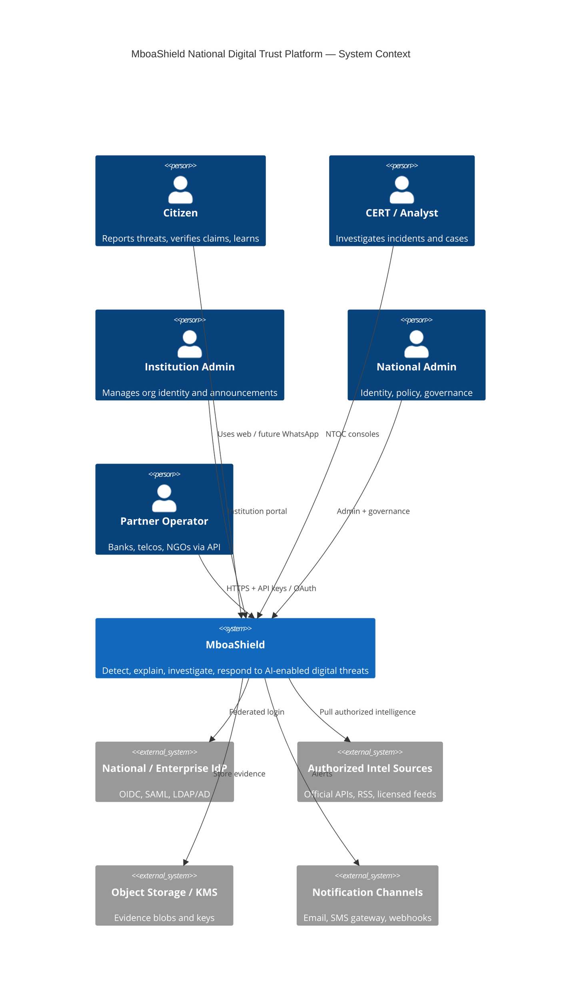

### Justification

Single platform boundary keeps deployment simple for ministries while exposing clear external dependencies (IdP, storage, compliant feeds). Multi-country = multiple deployments or multi-tenant config inside the same boundary.

---

## 2. Container Diagram (C4 Level 2)

```mermaid
C4Container
title MboaShield — Containers (target after Phase 13; today = single API container)
Person(user, "Users", "All personas")
Container(web, "Web Consoles", "Static HTML/JS", "Citizen, Analyst NTOC, Institution, Admin")
Container(api, "Trust API", "FastAPI", "Auth, workflow, AI, analytics, vault APIs")
Container(worker, "Async Workers", "Celery", "Intel ingest, heavy AI, retention jobs")
ContainerDb(db, "Primary DB", "PostgreSQL", "Transactional state")
ContainerDb(redis, "Cache / Broker assist", "Redis", "Sessions, rate, queues assist")
ContainerDb(mq, "Message Broker", "RabbitMQ", "Job dispatch")
ContainerDb(obj, "Object Store", "S3-compatible", "Evidence media")
Container(obs, "Observability", "Prometheus/Grafana/Loki", "Metrics logs traces")
System_Ext(idp, "IdP")
Rel(user, web, "HTTPS")
Rel(web, api, "JSON /api/v1")
Rel(api, db, "SQL")
Rel(api, redis, "Session/cache")
Rel(api, mq, "Enqueue")
Rel(worker, mq, "Consume")
Rel(worker, db, "SQL")
Rel(worker, obj, "Read/write")
Rel(api, obj, "Presign/store")
Rel(api, idp, "OIDC/SAML")
Rel(api, obs, "Expose metrics")
Rel(worker, obs, "Expose metrics")
```

**Today (v0.9):** `web` + `api` colocated in one Docker image; SQLite or Postgres; no worker/redis/mq/obj. Phases add containers without removing the monolith entrypoint until K8s chart lands.

---

## 3. Component Diagram (C4 Level 3) — Trust API

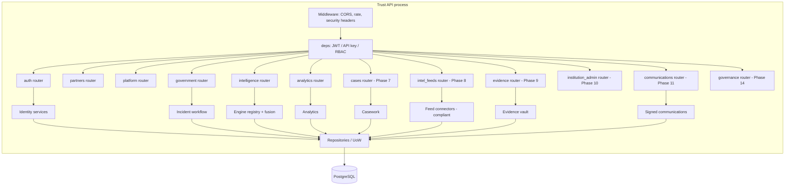

---

## 4. C4 Level 4 — Identity component (Phase 6 focus)

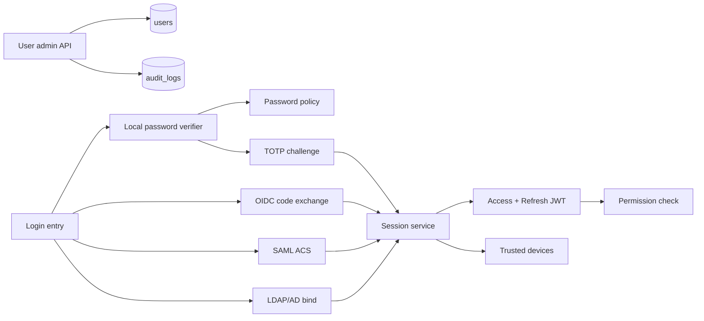

**Justification:** Complete the existing OIDC scaffold and MFA rather than replacing JWT. SAML/LDAP adapters feed the same session service so RBAC remains one place (`rbac.py` + `deps.py`).

---

## 5. Database ER (logical target)

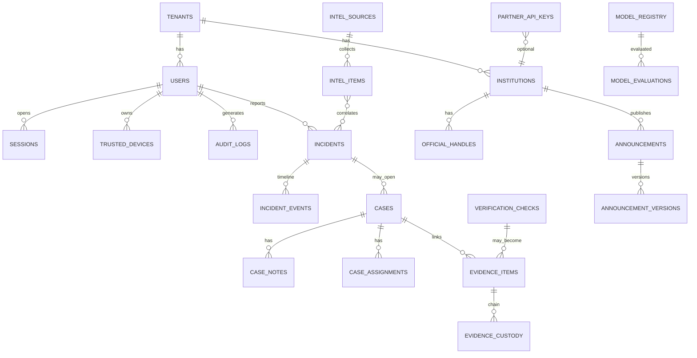

**v0.9 reused entities:** users, institutions, official handles, verification_checks, incidents, audit, partner keys, MFA fields.  
**Additive only:** tenants, sessions, devices, cases, evidence_*, announcements, intel_*, model_*.

---

## 6. Service dependency diagram

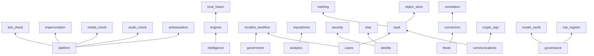

---

## 7. API dependency diagram

```mermaid
flowchart LR
  UI[Consoles] --> AuthAPI[/auth/*]
  UI --> PlatAPI[/check /analyze /incidents]
  UI --> GovAPI[/analyst /workflow]
  UI --> AnalAPI[/analytics/*]
  UI --> IntelAPI[/intelligence/*]
  UI --> CaseAPI[/cases/*]
  UI --> VaultAPI[/evidence/*]
  UI --> InstAPI[/institutions-admin/*]
  UI --> CommAPI[/announcements/*]
  Partners[Partners] --> KeyAuth[X-API-Key] --> PlatAPI & IntelAPI
  AuthAPI --> IdP[External IdP]
  VaultAPI --> S3[Object storage]
  CaseAPI --> GovAPI
  CommAPI --> VaultAPI
```

**Compatibility rule:** Existing paths keep verbs and schemas; new fields are optional; new resources get new prefixes.

---

## 8. AI pipeline diagram

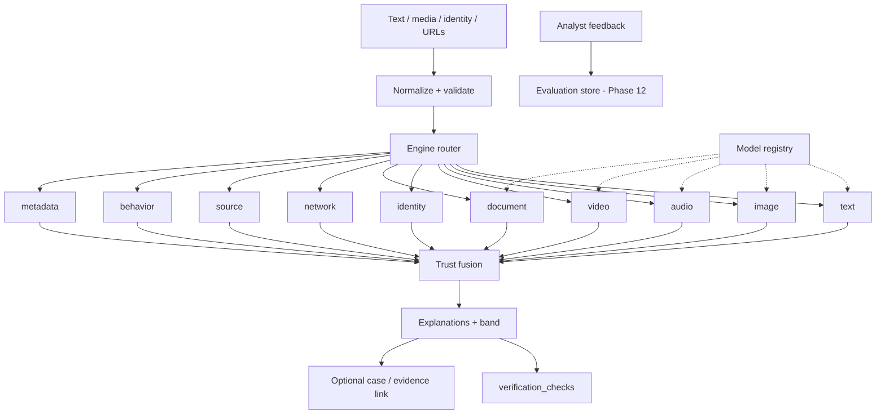

Policy: unsupported engines return explicit scaffold status; fusion never invents certainty.

---

## 9. Identity flow diagram

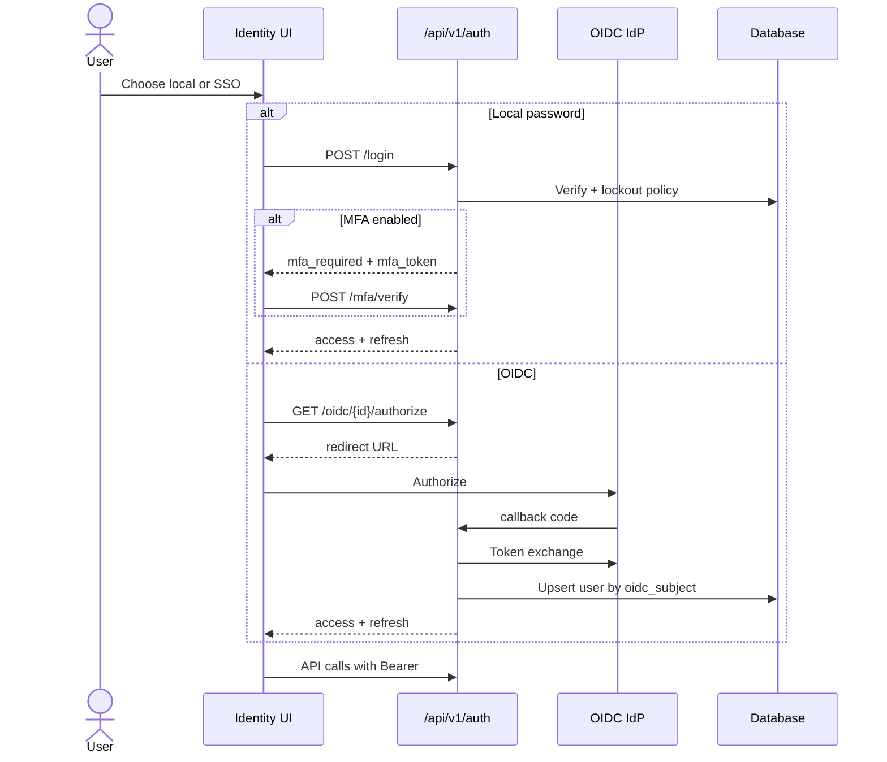

SAML/LDAP follow the same post-auth session issuance.

---

## 10. Incident workflow diagram

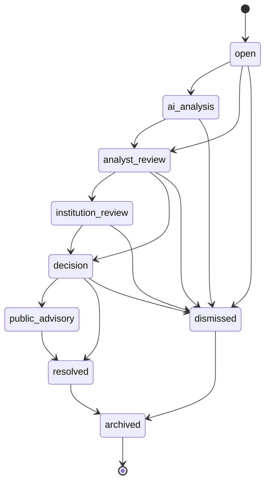

**Phase 7 extension:** Cases attach to incidents without replacing this machine; case states are orthogonal (intake, investigating, pending_institution, closed).

---

## 11. Evidence management workflow

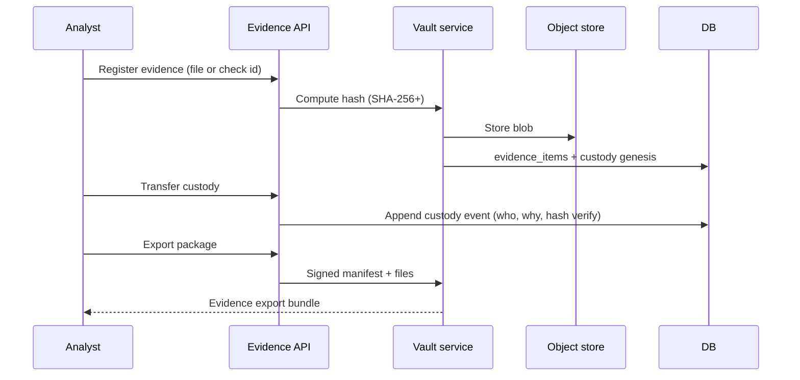

---

## 12. Deployment diagram (target national)

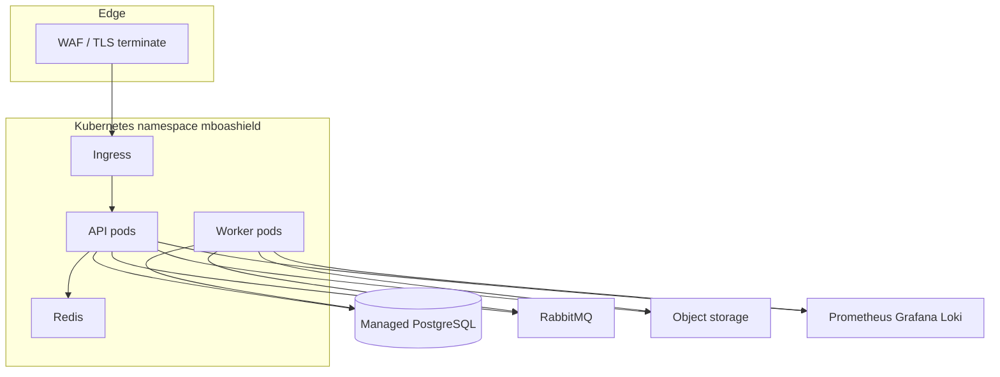

**Demo profile retained:** single Docker web service on Render.

---

## 13. Network architecture

- Public zone: citizen UI, public verify URLs, health  
- Auth zone: IdP callbacks restricted by path  
- Operations zone: NTOC / admin (IP allowlists or VPN optional via config)  
- Partner zone: API keys + mTLS optional later  
- Data zone: Postgres, Redis, object store — private subnets  
- Egress allowlist for intel connectors (Phase 8)

---

## 14. Security architecture

| Layer | Controls |
|---|---|
| Edge | TLS 1.2+, HSTS, WAF rules |
| App | AUTH_ENFORCE profiles, RBAC, MFA, session revoke |
| Data | Encryption at rest, field encryption for secrets, hashed API keys |
| Evidence | Hash integrity, custody log, signed export |
| AI | Input size limits, no tool-execution from untrusted text, model allowlist |
| Ops | Audit logs immutable append, SIEM export |
| Supply chain | Pinned deps, CI tests, image scan (Phase 13) |

---

## 15. Trust score pipeline

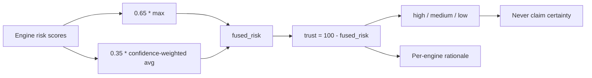

Phase 12 may add calibrated probabilities **as separate fields** without removing heuristic trust.

---

## 16. Government operations workflow

1. Signal in (citizen report, partner API, intel feed)  
2. Incident opened ? AI analysis  
3. Analyst triage (NTOC) ? case assignment  
4. Evidence capture ? institution review if needed  
5. Decision ? public advisory and/or verified announcement  
6. Resolve ? archive ? retention policy  

---

## 17. Journey maps

### Citizen

Discover ? check claim/media ? optional report incident ? track status ? learn (Ambassadors) ? verify official announcement QR.

### Analyst

Login (MFA/SSO) ? national threat level ? queue ? open investigation workspace ? notes/evidence ? transition incident ? feedback labels ? close case.

### Institution administrator

SSO ? manage domains/handles ? review assigned incidents ? publish signed announcement ? view org analytics ? rotate API keys.

### Partner API

Obtain key ? `GET /partners/me` ? create checks / submit incidents per scopes ? consume webhooks (Phase 7+) ? rotate key.

---

## 18. Multi-country configuration model

```yaml
# Conceptual — implemented Phase 6+ as env + DB tenant profile
tenant:
  id: cm
  display_name: Cameroon
  languages: [en, fr]
  regions: [Adamawa, Centre, ...]
  idp: { type: oidc, issuer: ..., client_id: ... }
  branding: { app_name: MboaShield, primary_color: "..." }
  policies:
    auth_enforce: true
    mfa_required_roles: [admin, analyst]
    retention_days: 2555
    threat_level_thresholds: { elevated: 40, high: 70, critical: 85 }
  intel_egress_allowlist: ["https://rss.official.gov.cm/", "https://api..."]
```

Code paths read tenant context; no country forks.

---

## 19. UX principles (Principal UX)

- One job per console section; NTOC is operational, not marketing  
- Preserve Grand Jury demo as a **demo profile skin**, not the ops default  
- Progressive enhancement on existing HTML; optional later SPA only if needed  
- Accessibility: keyboard paths, contrast, language toggle EN/FR  
- Never show fake certainty badges on AI output  

---

## 20. Design decisions log

| Decision | Choice | Justification |
|---|---|---|
| Evolve monolith first | Yes | Avoid rewrite; seams already exist |
| Keep `/api/v1` | Yes | Non-breaking mandate |
| Soft auth demo profile | Retain | Competition + civic access |
| Cases vs incidents | Parallel models | Don’t break workflow machine |
| Intel compliance | Official APIs/RSS only | Legal & adoption fitness |
| Evidence additive | New tables | Don’t overload verification_checks |
| AI certainty | Remain none by default | Governance honesty |

**Next:** [`V1_0_THREAT_MODEL.md`](V1_0_THREAT_MODEL.md)
